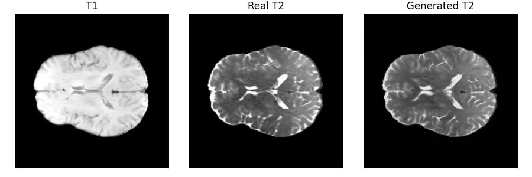

# Brain MRI GAN (T1n → T2w) on BraTS 2023

This project trains a pix2pix GAN (U-Net generator + PatchGAN discriminator)
to synthesize T2-weighted (T2w) 2D brain MRI slices from T1-normalized (T1n) slices using
the BraTS 2023 dataset.

## Example Output

Below is an example showing the model’s inference output (T1 → Real T2 → Generated T2):

  

## Project structure

- `preprocess_brats.py` — converts BraTS 2023 volumes into 2D paired slices (.npz)
- `split_brats_slices.py` — splits slices into train/val/test sets
- `dataset_brats.py` — PyTorch Dataset/DataLoader for BraTS slices
- `model_brats.py` — U-Net generator and PatchGAN discriminator
- `train_brats.py` — training loop (GAN + L1 loss)
- `evaluate_brats.py` — PSNR/SSIM evaluation
- `evaluate_plots_brats.py` — histogram + Bland–Altman plots
- `inference_2d_brats.py` — inference, saves T1 / Real T2 / Generated T2 images in .png format

## Environment

- OS: Windows
- Python: 3.10
- GPU: NVIDIA RTX 3080 Ti
- Framework: PyTorch

## Data

The BraTS 2023 dataset is **not** included in this repository.

To run the code, you must:
1. Request BraTS 2023 access from the organisers.
2. Place the data under `data/BraTS2023/` as described in the code.
